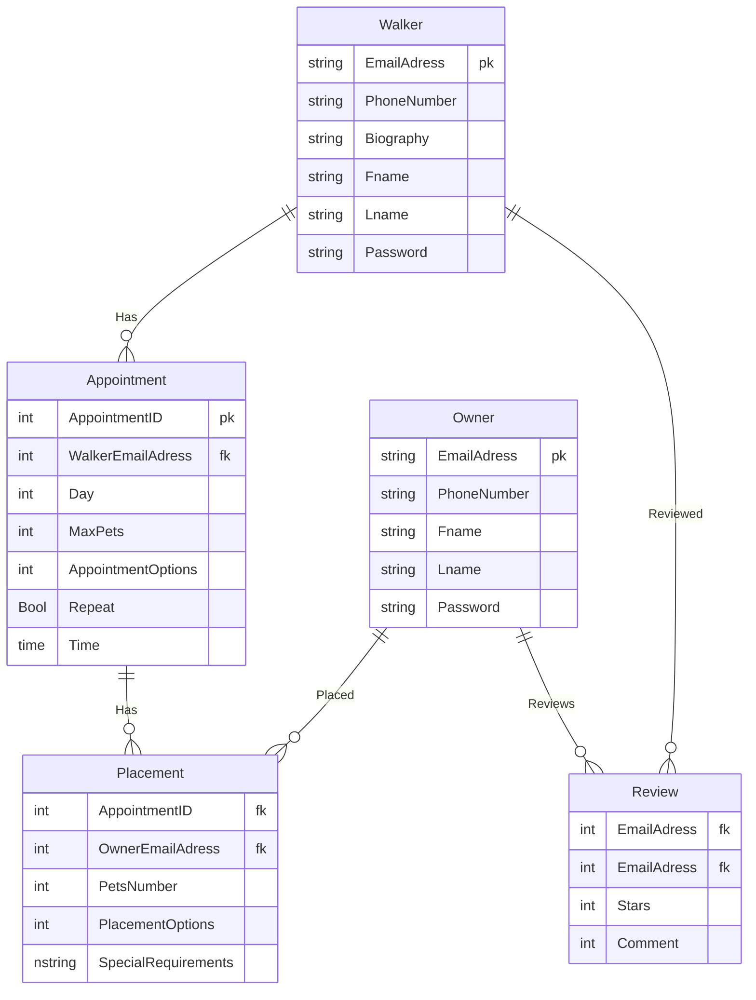

```mermaid
erDiagram

Walker ||--o{Appointment: Has
Appointment ||--o{Placement: Has
Owner ||--o{Placement: Placed
Walker ||--o{Review: Reviewed
Owner ||--o{Review: Reviews

Walker {
  string EmailAdress pk
  string PhoneNumber
  string Biography 
  string Fname
  string Lname
  string Password }

Owner {
  string EmailAdress pk
  string PhoneNumber 
  string Fname
  string Lname
  string Password }

Appointment {
  int AppointmentID pk
  int WalkerEmailAdress fk
  int Day 
  int MaxPets
  int AppointmentOptions
  Bool Repeat
  time Time }

Placement {
  int AppointmentID fk
  int OwnerEmailAdress fk
  int PetsNumber
  int PlacementOptions
  nstring SpecialRequirements }

Review {
  int EmailAdress fk
  int EmailAdress fk
  int Stars
  int Comment }

```
